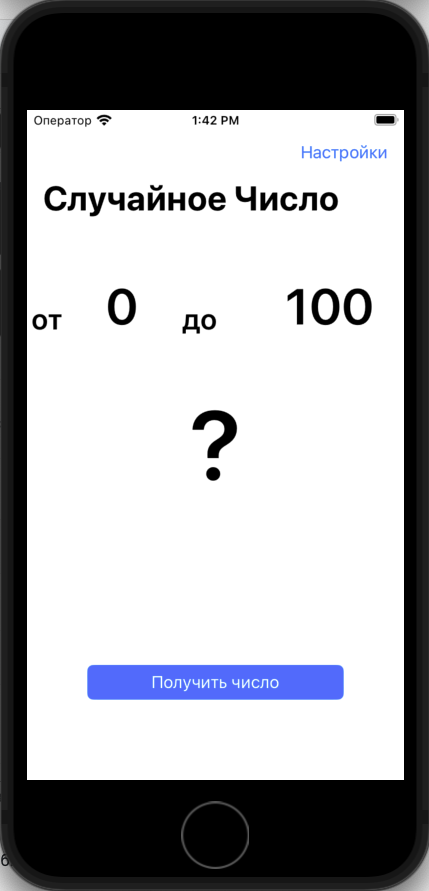
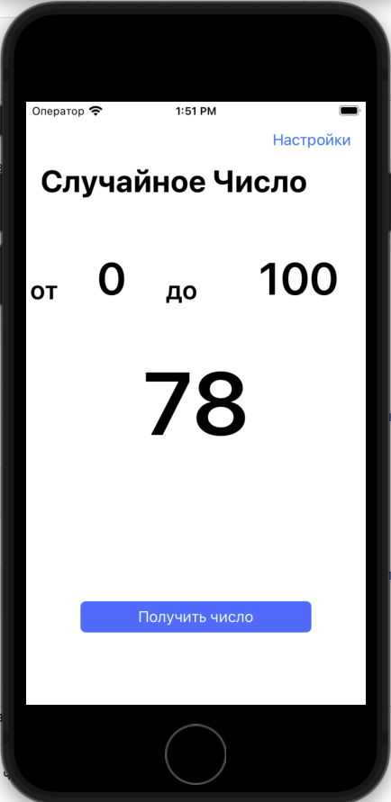
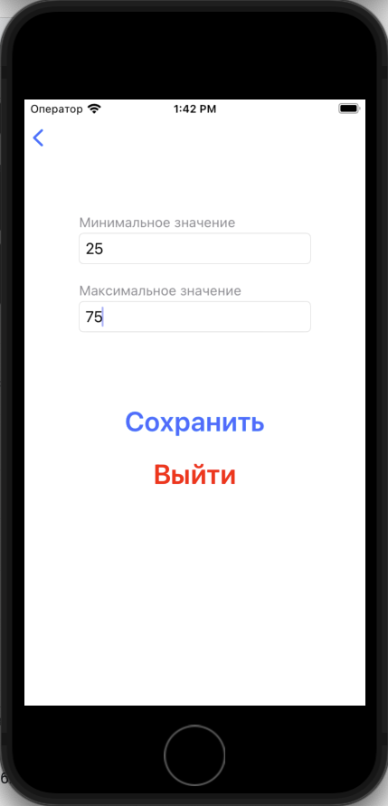
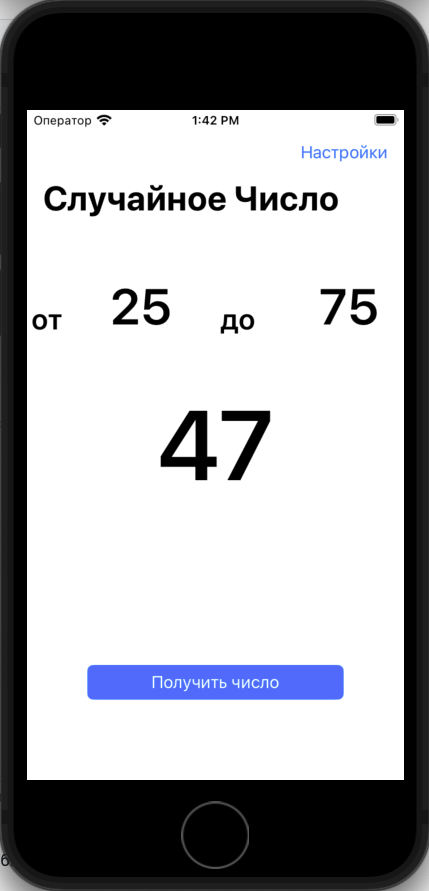

# RandomizerApp

Приложение Randomizer является учебным, для практической наработки навыков программирования.

Все UI-элементы написаны програмно, без использования "storyboard" и "xib".

В приложении использовались такие элементы пользовательского интерфейса, как: 
UIlabel, UIButton, UITextField, UIStackView, UIBarButtonItem, UINavigationController.

Для возврата отредактированных данных, с экрана настроек на главный экран, применен **шаблон проектирования -"Делегирование"**.

---
**RandomizerApp - позволяет получить случайное число из заданного пользавателем диапазона чисел.**

При старте приложения, диапазон случайных  чисел варьируется от 0 до 100.
Нажимая на кнопку "Получить результат", на экране отображается случайное число в пределах диапазона.

  

Перейдя на эран "Настройки", пользователь может задать свой диапазон чисел.

  
 